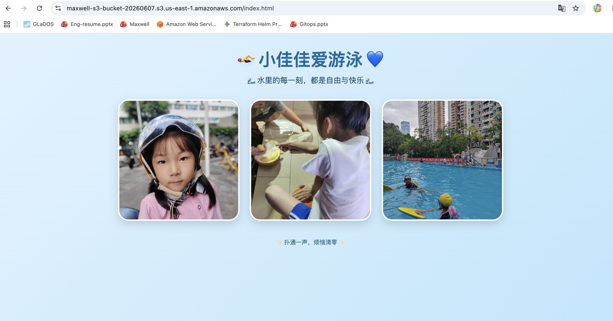

# calling-terraform-modules-s3-website

This demo will show you how to call a s3 terraform aws module in another repo to create a static website , I also intergrated the github actions workflow to deploy this website after PR merged.

## Usage

- call the S3 module in another repository
```shell
module "s3-bucket" {
  source = "git::https://github.com/pengchao2022/aws-terraform-modules.git//modules/s3?ref=s3-1.4"
  bucket_name = "maxwell-s3-bucket-20260607" # This is a globally unique identifier for AWS S3 services
  # enable s3 static website
  enable_website = true
  tags = {
    Name = "R-D-bucket" # This is for human reading show in aws console do not use space
    Demo = "For calling module demo"
    
  }
  
}
```

## Show you the website




